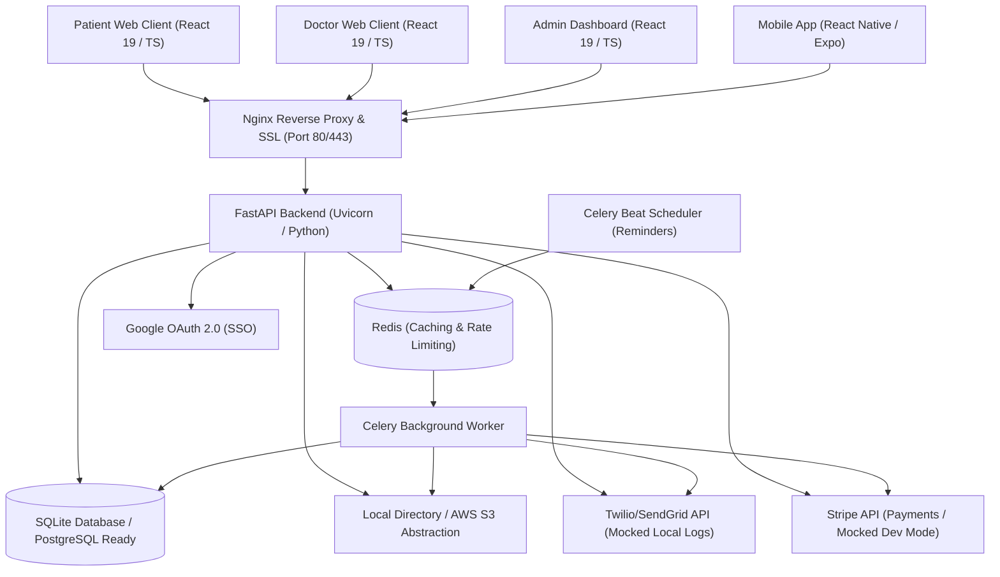
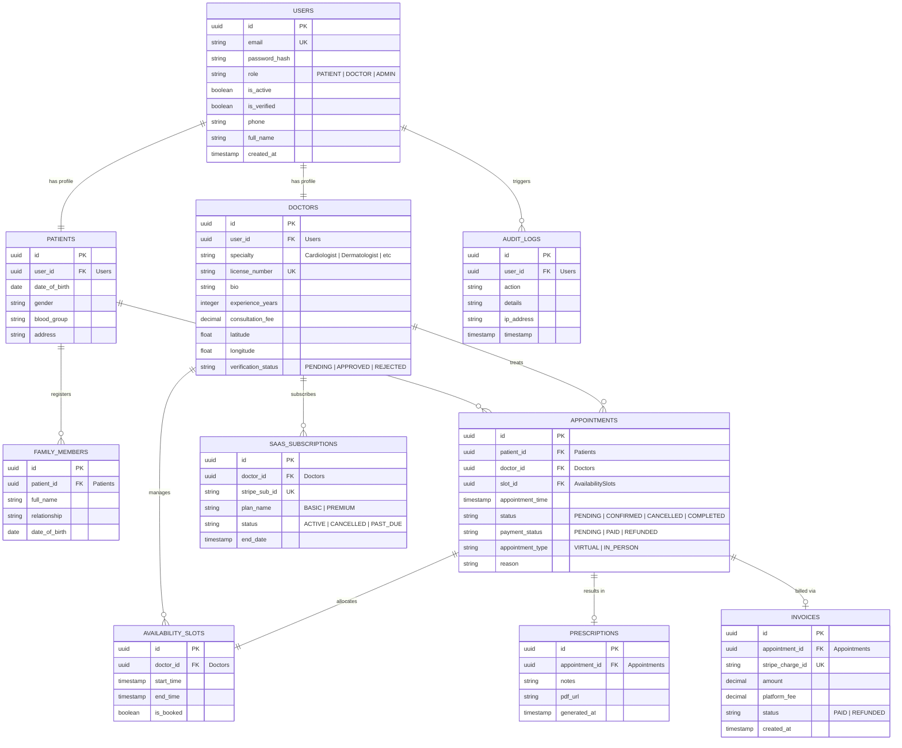

# Implementation Plan - SaaS Doctor Appointment Platform (Zocdoc Clone)

This document provides a highly detailed, enterprise-grade architecture design and phased implementation roadmap for the SaaS Doctor Appointment Platform. The codebase will be developed under the path [Doctor-App](file:///C:/RamKotni/GitHub/interview-prep/Doctor-App).

---

## High-Level System Architecture

We employ a modern, highly decoupled architecture using React for the frontend client, FastAPI for the high-performance asynchronous REST backend API, SQLite (with Postgres compatibility) for structured data storage, Redis + Celery for asynchronous jobs (emails, SMS, WebRTC token expiry, reminders), and Stripe/AWS abstractions which operate with local fallback / mocked systems when credentials are not configured.



---

## Project Directory Structure

We adopt a clean feature-based architecture for the frontend web and mobile, and a multi-layered clean architecture for the backend (Separation of Concerns: Domain, Application, Repository, Infrastructure, API layers).

```
Doctor-App/
├── backend/
│   ├── app/
│   │   ├── __init__.py
│   │   ├── main.py                    # Entry point for FastAPI, Middleware, CORS, Exception handlers
│   │   ├── config.py                  # Pydantic BaseSettings for configuration & environment variables
│   │   ├── core/
│   │   │   ├── security.py            # JWT tokens generation, password hashing, OTP generator, RBAC rules
│   │   │   ├── database.py            # SQLAlchemy engine, declarative base, session generator
│   │   │   ├── logging.py             # Structured JSON logger setup
│   │   │   └── exceptions.py          # Domain & application-level specific errors
│   │   ├── domain/                    # Enterprise business entities
│   │   │   ├── __init__.py
│   │   │   └── entities.py            # Pure domain models (User, Patient, Doctor, Appointment, Slot)
│   │   ├── repository/                # Data access objects (Repository Pattern)
│   │   │   ├── base.py                # Abstract generic SQLAlchemy CRUD repository
│   │   │   ├── user_repo.py
│   │   │   ├── doctor_repo.py
│   │   │   └── appointment_repo.py
│   │   ├── services/                  # Business services containing application logic
│   │   │   ├── auth_service.py        # Credentials check, OTP validation, SSO, JWT refresh
│   │   │   ├── doctor_service.py      # Slot generation logic, profile setup, verification
│   │   │   ├── appointment_service.py # Booking, cancellation limits, conflict checks, refund processing
│   │   │   └── payment_service.py     # Stripe billing, checkouts, webhook handlers, subscriptions
│   │   ├── infrastructure/            # Third-party adapters & outer boundary
│   │   │   ├── storage/               # Local/S3 abstract file manager (local fallback active)
│   │   │   ├── payment/               # Stripe client integration (mocked fallback active)
│   │   │   ├── notification/          # SMS, Email & Push notification clients (local file log fallback active)
│   │   │   └── queue/                 # Celery app config and asynchronous tasks
│   │   ├── api/                       # API routing layer
│   │   │   ├── v1/
│   │   │   │   ├── auth.py            # SignUp, Login, Google Auth, Refresh, OTP
│   │   │   │   ├── users.py           # Patient profiles, family members, docs upload
│   │   │   │   ├── doctors.py         # Search, slot booking, verification, dashboards
│   │   │   │   ├── appointments.py    # Book, reschedule, cancel, consult notes, pdf prescriptions
│   │   │   │   ├── payments.py        # Stripe checkouts, webhook endpoint, SaaS plan checkout
│   │   │   │   └── admin.py           # User management, audit logs, revenue dashboard
│   │   │   └── deps.py                # API dependency injections (DB sessions, current user, RBAC rules)
│   │   └── db/
│   │       ├── models.py              # Declarative SQLAlchemy models (User, Patient, Doctor, Slot, Appointment, etc.)
│   │       ├── base.py                # Database metadata base registry for Alembic auto-generation
│   │       └── base_class.py          # Core mixins (timestamp, UUID primary keys)
│   ├── alembic/                       # Alembic migrations directory
│   ├── alembic.ini                    # Alembic configuration
│   ├── tests/                         # Pytest test cases (unit, integration, mocking interfaces)
│   ├── requirements.txt               # Dependencies list
│   └── Dockerfile                     # Docker deployment config
│
├── frontend/
│   ├── src/
│   │   ├── assets/                    # Static visual assets (illustrations, logos)
│   │   ├── components/                # Global UI design components (Buttons, Modals, Loaders, Calendar Grid)
│   │   ├── context/                   # Global React contexts (Theme context, UI state)
│   │   ├── features/                  # Domain-driven features (Modular, self-contained files)
│   │   │   ├── auth/                  # SignUpForm, LoginForm, GoogleCallback, OTPInput
│   │   │   ├── patient/               # Dashboard, ProfileSettings, FamilyMembers, SearchDoctorPanel, BookingWizard
│   │   │   ├── doctor/                # Dashboard, AvailabilityScheduler, AppointmentManager, DigitalPrescriptionForm
│   │   │   └── admin/                 # UserListTable, FinancialLedger, SystemSettings, MetricsDashboard
│   │   ├── hooks/                     # Custom global hooks (useDebounce, useMediaQuery)
│   │   ├── layouts/                   # Shared shell layouts (DashboardLayout, AuthLayout, GuestLayout)
│   │   ├── routes/                    # React Router definitions (guards, lazy loading components)
│   │   ├── services/                  # Global API client (Axios Interceptors, Refresh Interceptors, Error Handling)
│   │   ├── store/                     # Zustand central store (authSlice, userSlice, appointmentSlice)
│   │   ├── theme/                     # MUI / Tailwind CSS dynamic theme variables
│   │   ├── types/                     # TypeScript shared interfaces
│   │   └── utils/                     # Formatters, Date conversion, PDF generator wrapper
│   ├── package.json                   # UI configuration, dependencies (React 19, TS 5, MUI, Tailwind, Vite)
│   ├── tsconfig.json                  # TypeScript compiler settings
│   ├── vite.config.ts                 # Bundling configuration
│   └── Dockerfile                     # Nginx UI deployment configuration
│
├── mobile/                            # Future Native Mobile App (React Native + Expo)
│   ├── App.tsx                        # Root Navigation Container & Providers
│   ├── app.json                       # Expo application config (bundle ID, permissions, plugins)
│   ├── src/
│   │   ├── components/                # Shared Native UI elements (Custom buttons, fields, cards)
│   │   ├── features/                  # Ported screens/features (Search, Booking, AppointmentHistory)
│   │   ├── navigation/                # React Navigation stacks (Tab navigator, Auth flow, Drawer)
│   │   ├── services/                  # Mobile Axios client pointing to API_URL config
│   │   ├── store/                     # Shared Zustand state store logic
│   │   └── types/                     # Shared TS types
│   ├── tsconfig.json                  # TS settings for Expo
│   ├── package.json                   # Native dependencies (React Native, Expo, Axios, Zustand)
│   └── README.md                      # Build & Run instructions for iOS/Android
│
├── docker-compose.yml                 # Local cluster running Backend, Frontend, Redis, and Celery
├── nginx.conf                         # Main reverse proxy and caching rule layer
└── README.md                          # General startup guide
```

---

## Database Architecture (ER Diagram & Models)

We've designed a highly normalized schema using **UUIDs** as primary keys for security, **indexes** on search/query fields (specialty, coordinates, timestamps), and full constraints.

### Entity Relationship Model



---

## Security Architecture

1. **Authentication**: JWT access tokens (short-lived, 15m) + JWT refresh tokens (7 days, rotation, secure HttpOnly cookies for web, secure async storage for mobile). OTP-based sign-in option.
2. **Authorization**: Strict Role-Based Access Control (RBAC) middleware checks user role (`Patient`, `Doctor`, `Admin`) at route definitions.
3. **Database Integrity**: Primary keys use UUIDv4 to protect against resource enumeration attacks.
4. **Input Sanitization**: Pydantic v2 validation constraints against injection payloads. Strict typing on CORS, helmet-like security headers inside FastAPI.
5. **Data Protection**: Encryption at rest (PostgreSQL standard) + strict TLS in-transit. Document files uploaded to Storage are validated for MIME type, restricted to 5MB, and stored with random UUID filenames.
6. **Audit Trails**: Track any sensitive write actions (`DELETE`, `UPDATE`, authentication failures) in `audit_logs`.

---

## Future React Native Mobile Architecture (iOS & Android)

The platform is designed to seamlessly support React Native (Expo) mobile clients for patients and doctors. 

### Core Native Strategy
1. **Shared State & REST Endpoints**: The mobile app consumes the same FastAPI backend API endpoints. It uses Zustand stores for shared client state, mirroring the web logic.
2. **Expo SDK Ecosystem**:
   - **Expo Router** or **React Navigation** for native stacking and deep linking.
   - **Expo Secure Store** for securely storing JWT tokens, which is fully OS-sandboxed (iOS Keychain, Android Keystore).
   - **React Native WebRTC / Twilio Native SDKs** for rich in-app video consultations.
3. **Configuration Mechanism**:
   - Environment variables loaded via `.env` file on runtime (`EXPO_PUBLIC_API_URL`).
   - Easily deployable onto Expo Go for development, and generated into local `.ipa` (Apple) and `.apk` / `.aab` (Google Play) builds.

### Mobile Directory & Running Architecture
We include a standard scaffold and complete configuration setup guide in `mobile/README.md` to make this setup configurable for compilation anytime.

---

## Incremental Execution Phases

We will build the codebase systematically, validating each phase as we go:

| Phase | Title | Focus / Deliverables | Status |
|---|---|---|---|
| **Phase 1** | **Architecture & DB Design** | Finalize layout, design DB schema models, Alembic configuration, and architectural models. | **Current** |
| **Phase 2** | **Backend Foundation** | JWT security, mock modes, custom error handlers, Pydantic DTOs, Repository setup, User/Auth FastAPI routers. | *Pending* |
| **Phase 3** | **Frontend Foundation** | Vite scaffolding, Zustand state, MUI components, Axios setup, Auth flows (Login, Register, OTP). | *Pending* |
| **Phase 4** | **Appointment Workflow** | Slot generators, booking logic, multi-step scheduling, calendar screens, prescription PDF downloads. | *Pending* |
| **Phase 5** | **Payments & notifications** | Stripe/AWS mocks, webhook structures, SaaS subscription checks, local email/SMS log output templates. | *Pending* |
| **Phase 6** | **Admin Dashboard** | Analytics engines, dynamic ledger, role modifications, refund managers. | *Pending* |
| **Phase 7** | **Testing Suite** | pytest for backend repositories & controllers, vitest for React hooks & screens. | *Pending* |
| **Phase 8** | **Deployment & Docs** | Docker Compose configuration, production Nginx file setup, README and Mobile Setup guides. | *Pending* |

---

## User Review Required

> [!IMPORTANT]
> - **Mock/Local Infrastructure Fallback**: AWS S3 storage will automatically fall back to local disk storage (`/backend/storage/uploads/`). Stripe payment handlers will generate mock payment sheets/invoices, and Twilio/SendGrid notifications will log payload metadata directly into `/backend/logs/notifications.log` for high-fidelity testing without external accounts.
> - **Google OAuth 2.0**: Mock flows are added to ease frontend development so you do not need client secrets.
> - **React Native Mobile Setup**: We will generate the base folder structure, package files, and documentation for the Expo React Native app to make it compile-ready for both Android and Apple devices.

## Open Questions

> [!NOTE]
> 1. Should we configure Vite to support Tailwind CSS in addition to Material UI (we plan to use Tailwind for layout flexibility combined with Material UI's rich component catalog)?

---

**Please review this updated plan and provide your approval. Once approved, I will begin Phase 1 execution by setting up the project directories, database schemas, mock environment configurations, and Alembic files.**
